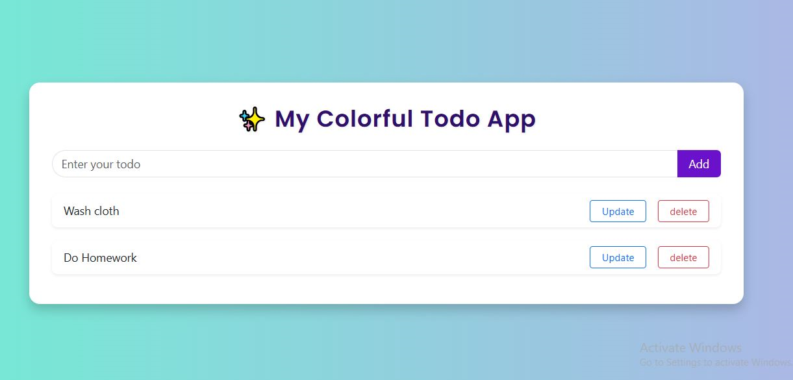

 # ✨ My Colorful Todo App

A beautiful and user-friendly Todo List Web App made with **HTML**, **Bootstrap 5**, and **Vanilla JavaScript**.  
Easily add, update, and delete your daily tasks.

---

## 📸 Screenshot
 

---

## 🌟 Features

- ✅ Add new todos
- ✏️ Edit/update existing todos
- ❌ Delete todos with one click
- 🚫 Prevents blank todos
- 🎨 Stylish and responsive UI with gradient background

---

## 🛠️ Tech Stack

- HTML5  
- CSS3 + Bootstrap 5  
- JavaScript (Vanilla)  
- Google Fonts (Poppins)

---

## 🚀 How to Run Locally
Open index.html in your browser
- Double-click the file
OR
- Use Live Server in VS Code (Recommended)
  
## 📁 Project Structure

todo-app/
│
├── index.html       # UI structure
├── script.js        # JavaScript logic
├── README.md        # Project description
└── screenshot.png   # Optional preview image

# 👩‍💻 Author
Romena Afrose Choity
Frontend learner & project builder from Bangladesh 🌏

